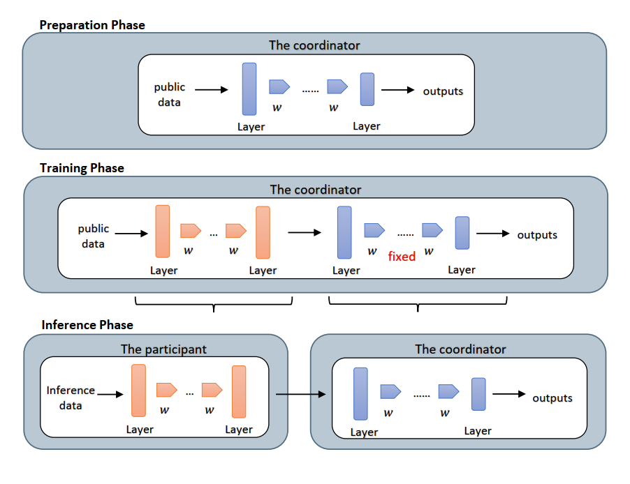

# ObfNet-showcase

## Obfuscation results of audio files 

Source of Dataset: [Free Spoken Digit Dataset (FSDD)](https://github.com/Jakobovski/free-spoken-digit-dataset)  

### Introduction to the Construction of ObfNet 

  

The construction of ObfNet involves three phases:  

1. Preparation phase  
The coordinator trains an inference model using public data samples or it can simply get a well-trained inference deep model from elsewhere.  

2. Training phase  
The coordinator trains the concatenation of the ObfNet and the pre-trained inference model,during which the parameters of the pre-trained inference model are fixed. The coordinator can train multiple ObfNets and send them all to each participant.  

3. Inference phase  
Each participant randomly choose one ObfNet,execute it and then send the obfuscated results to the coordinator for inference.  

### Obfuscation Results of ObfNet on FSDD 

In the FSDD dataset, there are 2000 audio samples (wav files). As for the data processing, we firstly use Mel-Frequency Cepstrum Coefficient (MFCC) to convert the wav files to 2-D images with the size 20*45. We suppose that the inference model at the coordinator takes the MFCC representations (images) as the input. ObfNet is then used to obfuscate the original MFCC representations (images). We split the data as 90% train-10% test. We tried two different structures of ObfNet when using two distinct inference models:

1. The structures of ObfNets:  
i. ObfNet_conv: it includes two convolutional layers, one maxpooling layer and one dense layer with ReLu activation.  
ii. ObfNet_fc: it includes two dense layers with ReLu activation.  

2. The structures of inference models:  
i. infmodel_conv: it includes three convolutional layers, one maxpooling layer and three dense layers with ReLu activation.  
ii. infmodel_fc: it includes five dense layers with ReLu activation.

In order to make a comparison between the original MFCC representations and the obfuscated ones, we do the MFCC inverse using the Phython package [LibROSA](https://librosa.github.io/librosa/) to convert MFCC representations back to audio (wav files). The audios converted from the original MFCC representations can still be recognized by human despite some noise. In contrast, the audios converted from the obfuscated MFCC representations are unrecognizable by human. Here, the MFCC inversed audios of 20 ramdom original MFCC representations in the test set and the corresponding obfuscated MFCC representations are shown.  

For the inversed audios form original MFCC representations, files are named in the follwing format:mfcc_inverse_test_{index} _ label _ {digit label}.wav. They are in the folder [mfcc_inverse_original](./mfcc_inverse_original).

For the inversed audios from obfuscated MFCC representations, files are named in the following format: inverse_obfnet_{conv/fc}+infmodel_{conv/fc}_ test _ {index} _ label _ {digit label}.wav.  
>For example, inverse_obfnet_conv+infmodel_conv_test_0_label_8.wav means that:  
>a) The involved ObfNet has the structure of 'ObfNet_conv';  
>b) In the training phase, the ObfNet is concatenated with the inference model with the structure of 'infmodel_conv';  
>c) The index of the MFCC representation in the test set is 0;  
>d) The true label of the MFCC representation is 8;  

The obfuscated results of the four obfNets are shown in the following four different folders:

1. [mfcc-inverse-obfnet_cnn+infmodel_cnn](./mfcc-inverse-obfnet_cnn+infmodel_cnn)

2. [mfcc-inverse-obfnet_cnn+infmodel_fc](./mfcc-inverse-obfnet_cnn+infmodel_fc)

3. [mfcc-inverse-obfnet_fc+infmodel_cnn](./mfcc-inverse-obfnet_fc+infmodel_cnn)

4. [mfcc-inverse-obfnet_fc+indmodel_fc](./mfcc-inverse-obfnet_fc+infmodel_fc)

### An example:
The audio inversed from the original MFCC representations:  

[mfcc_inverse_test_0_label_8.wav ](https://drive.google.com/file/d/1iHjHWWl2bLjnlxrBDsrH1KxUGjo2LGU2/view?usp=sharing)  

In the beginning part of the audio inversed from the raw MFCC representations, we can hear the content "eight". Note that there are also noises thereafter due to the necessary constant padding to the MFCC representations in the data processing step in order to unify the sizes of all the MFCC representations.

The audios inversed from the corresponding obfuscated MFCC representations by the four ObfNets:

[inverse_obfnet_conv+infmodel_conv_test_0_label_8.wav ](https://drive.google.com/file/d/1rX-LaCyfWNdPE3-99Ygsi5PtR6i25Ezs/view?usp=sharing)

[inverse_obfnet_conv+infmodel_fc_test_0_label_8.wav ](https://drive.google.com/file/d/1gtVU_c51N59ZUX9vDzOGclsngV0KSHGM/view?usp=sharing)

[inverse_obfnet_fc+infmodel_conv_test_0_label_8.wav ](https://drive.google.com/file/d/19lF8GVR0FjHtOeiPd7UM0rAClQzctwXM/view?usp=sharing)

[inverse_obfnet_fc+infmodel_fc_test_0_label_8.wav ](https://drive.google.com/file/d/13s2Asu-7IzDPZvYC4VvsapKZ6fX4MsvA/view?usp=sharing)  

These audios inversed from the corresponding obfuscated MFCC representations are totally unrecognizable by human.
